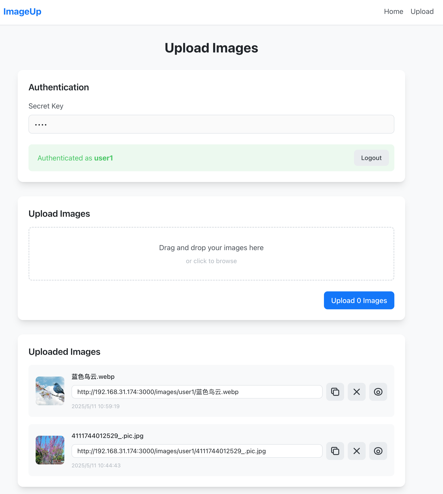

# 动态图片上传

<p align="center">适用于群微信群二维码等需要动态更新链接图片内容的场景</p>

<p align="center"></p>

<p align="center">
 <i> 基于 <a target="_blank" rel="noopener noreferrer" href="https://nuxt.com/">Nuxt</a> 借助 <a target="_blank" rel="noopener noreferrer" href="https://bolt.new/">Bolt</a>生成的第一版后微调（AI NB）</i>
</p>

体验地址：https://imageupload.test.sugarat.top

秘钥：`testpwd`，`test02`   (不定期清理测试上传的图片)

## 本地
### 开发预览
```sh
npm install

npm run dev
```

默认秘钥`testpwd`

### 构建预览
```sh
npm install

npm run build

# 将默认读取 .env 中配置的秘钥
npm run preview

# 或者 手动通过环境变量指定秘钥启动
SECRET_ACCOUNT_USER1=testpwd node .output/server/index.mjs
```

## 部署
### docker
```sh
docker run -d \
  --name image-uploader \
  -p 3000:3000 \
  -v $(pwd)/data:/app/data \
  -e NODE_ENV=production \
  -e HOST=0.0.0.0 \
  -e PORT=3000 \
  -e SECRET_ACCOUNT_USER1=your-secret-key-here \
  --restart unless-stopped \
  sugarjl/image-uploader
```
通过修改`SECRET_ACCOUNT_XXX`的值来设置秘钥 比如
```sh
  -e SECRET_ACCOUNT_HELLO=a123456 \
```


### pm2
```sh
# 拉代码
git clone https://github.com/ATQQ/image-uploader.git

# Gitee 地址（Github 访问不通畅）
git clone https://gitee.com/sugarjl/image-uploader.git

cd image-uploader

# 装依赖
npm install
# 构建
npm run build

# 启动
# 在 ecosystem.config.cjs env中添加或修改秘钥
pm2 start ecosystem.config.cjs
# 或者 启动时通过环境变量指定秘钥
SECRET_ACCOUNT_USER1=test pm2 start ecosystem.config.cjs
```

## FAQ
### 1 秘钥说明

以`SECRET_ACCOUNT_`开头的环境变量即视为秘钥的账户名
```sh
SECRET_ACCOUNT_USER1=testpwd
SECRET_ACCOUNT_SUGAR=test02
```
秘钥值可以通过 node 脚本随机自动生成☺️
```js
Math.random().toString(36).slice(2)
```

### 2 启动端口

通过环境变量 `PORT` 控制
```sh
PORT=3000
```